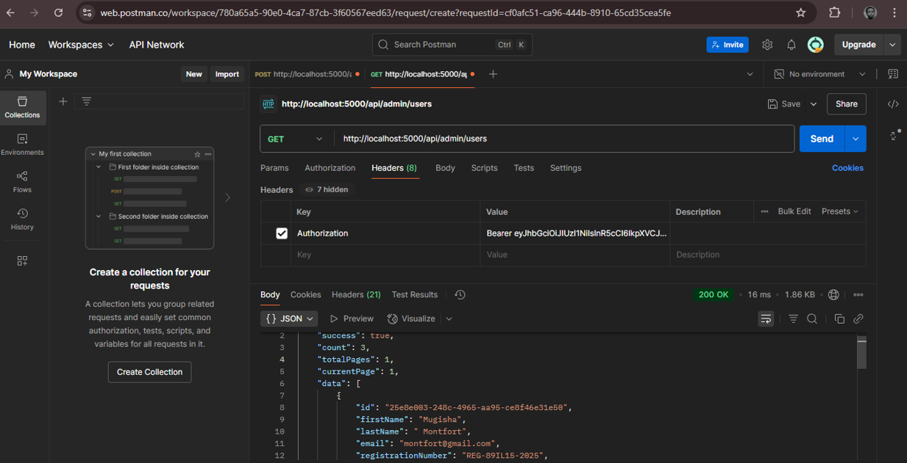
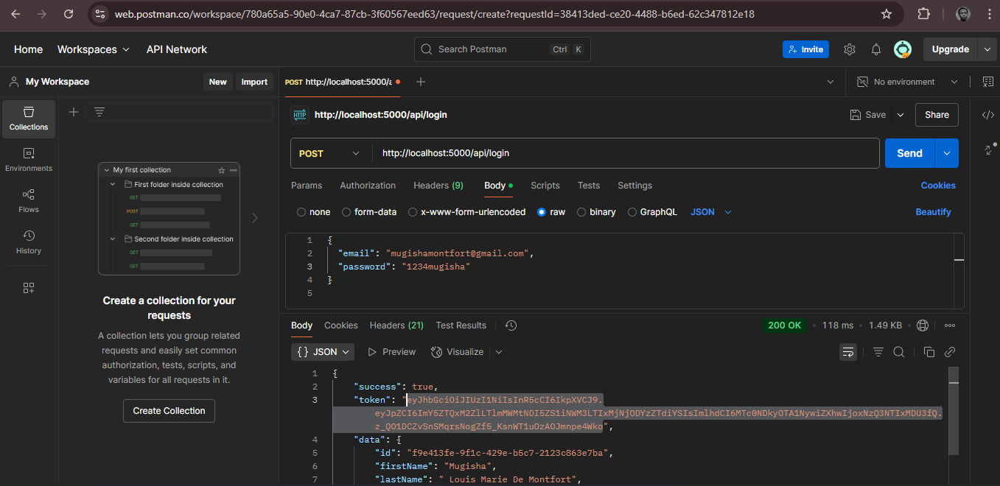
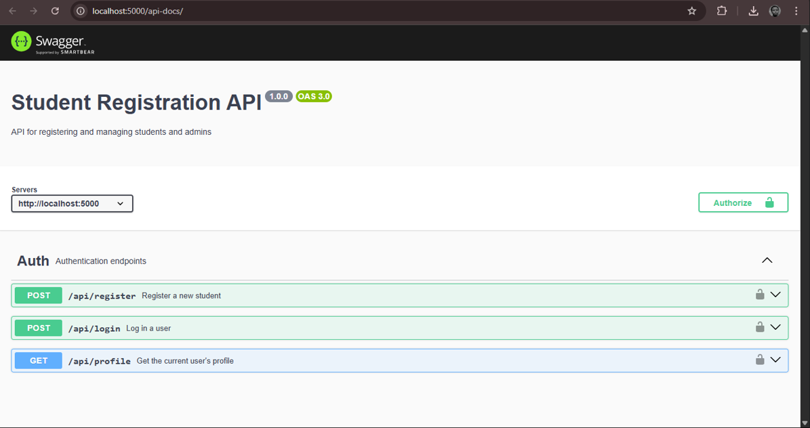

Backend README - Student Registration System

Overview:
This backend application provides a complete RESTful API for a student registration system using Node.js, Express, Sequelize ORM, and MySQL. It includes secure user registration, authentication with JWT, role-based access control, Swagger documentation, and basic CRUD operations for admin.

Features
- Register and authenticate users (students and admins)
- Admin can manage users: view, update, delete
- Unique registration numbers for students and admins
- Protected routes with JWT authentication
- Swagger API documentation at http://localhost:5000/api-docs
- Environment variable support with `.env`

Setup Instructions
1. Clone the repository:
   git clone https://github.com/Montfort28/student-registration-backend.git
   cd student-registration-backend
2. Install dependencies:
    npm install
3. Configure the `.env` file with your database and JWT credentials.
4. Run the server:
    npm run dev
5. The server runs on http://localhost:5000
6.  API documentation available at: http://localhost:5000/api-docs

Testing the API
Use Postman or Swagger at http://localhost:5000/api-docs to test endpoints such as:
- POST /api/register
- POST /api/login
- GET /api/profile
- GET /api/admin/users (admin only)

Admin Login Credentials (for testing)
- Email: admin@example.com
- Password: admin123

Note: Admin is seeded automatically when the server starts for the first time.

Technologies Used
- Node.js
- Express
- Sequelize ORM
- MySQL (via XAMPP)
- Swagger for API docs
- JWT for authentication

Bonus Features Implemented
- Swagger documentation is available at /api-docs
- Admins are seeded manually, and their registration number starts with ADM-
- Environment variables used for sensitive configuration

### API Testing with Postman and swagger

